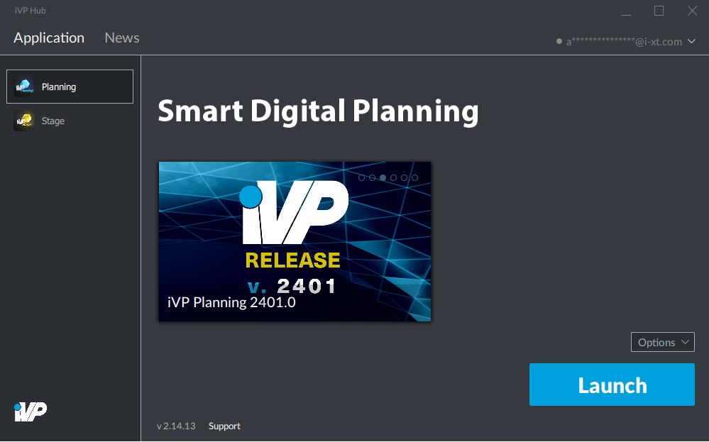

# iVP Hub

The iVP Hub is the central tool to manage all iVP applications on your computer or tablet. It is required to [activate licenses](application-management/license-activation.md) and [install](application-management/install-applications.md) iVP software. It will ensure that your programs will always be [up to date](application-management/installation-updates.md) and it offers you a [news feed](ivp-news.md) that you can use to stay informed about new features and content.

