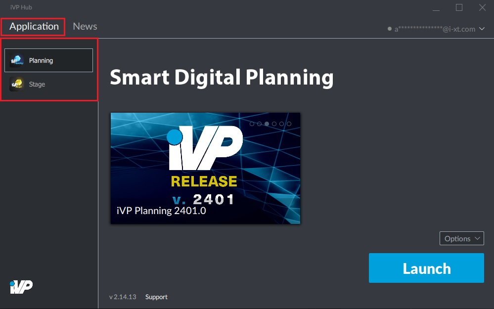
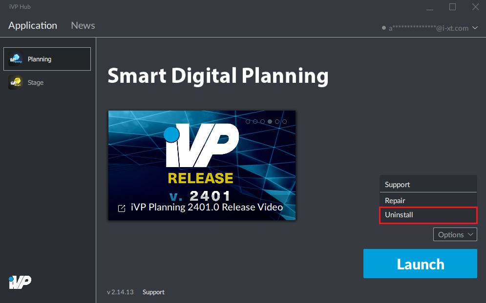

# Remove Installations

It is possible to remove iVP applications from your computer or tablet at any time.

## Step by step:

**1.** Got to the "Application" tab of the iVP Launcher and click on the application you want to remove.

**2.** In the bottom right corner click on the grey "Options" button and choose "Uninstall" from the appearing menu.

**3.** The launcher will now remove the application from your system. There is no further action required.
