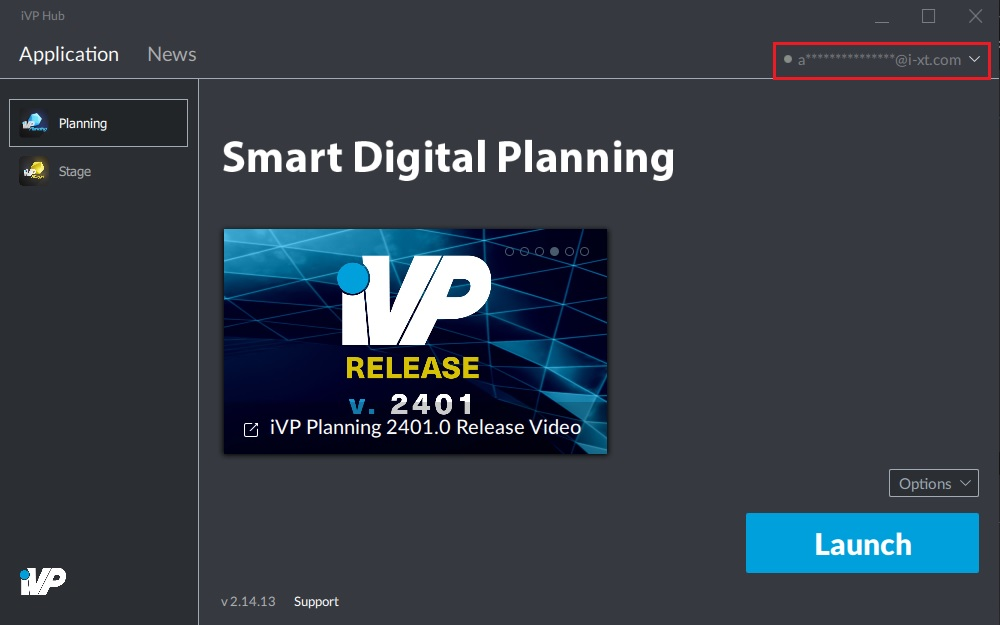
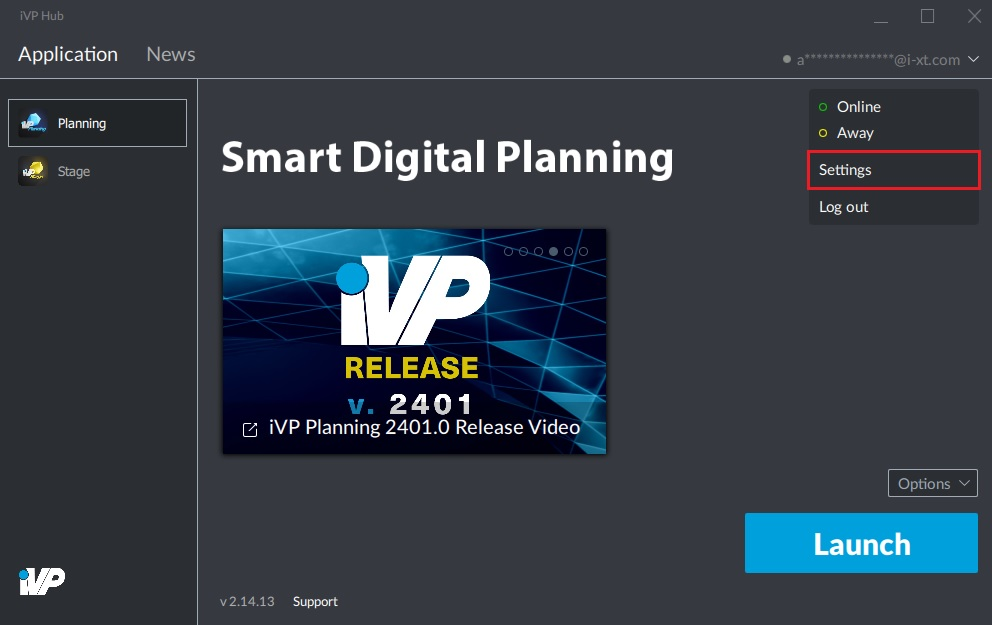

# P2P Connections

By default, the iVP Hub will work as P2P ("Peer-to-peer") application which obtains its data primarily from other computers in the same network instead of a server. This brings speed and stability advantages but can be disabled if necessary.

## Disabling the P2P mode:

**1.** Open the settings page by clicking on your account name / e-mail address in the top right corner of the window, followed by a click on "Settings".

**2.** Go to the "General" tab.

**3.** Uncheck the "Use a P2P connection" option.

